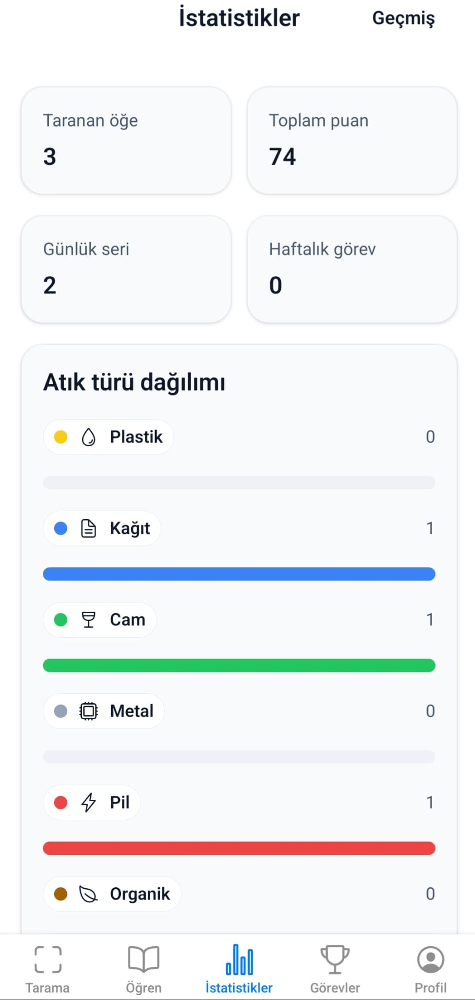
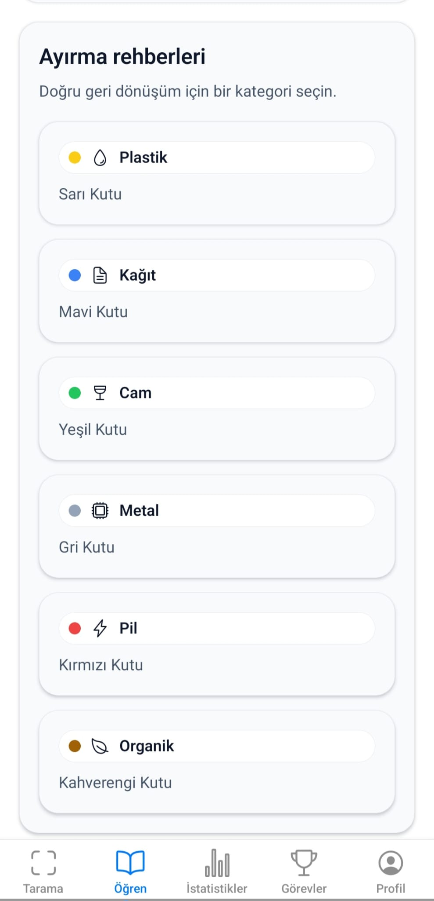
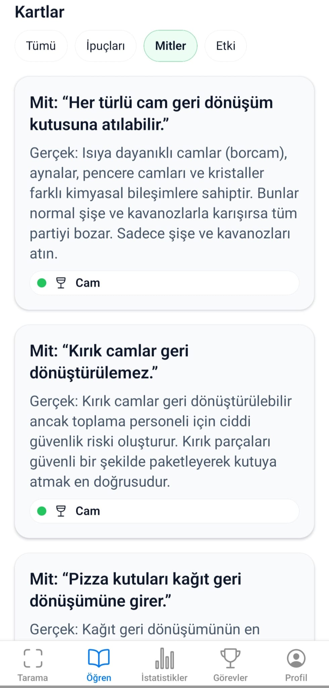
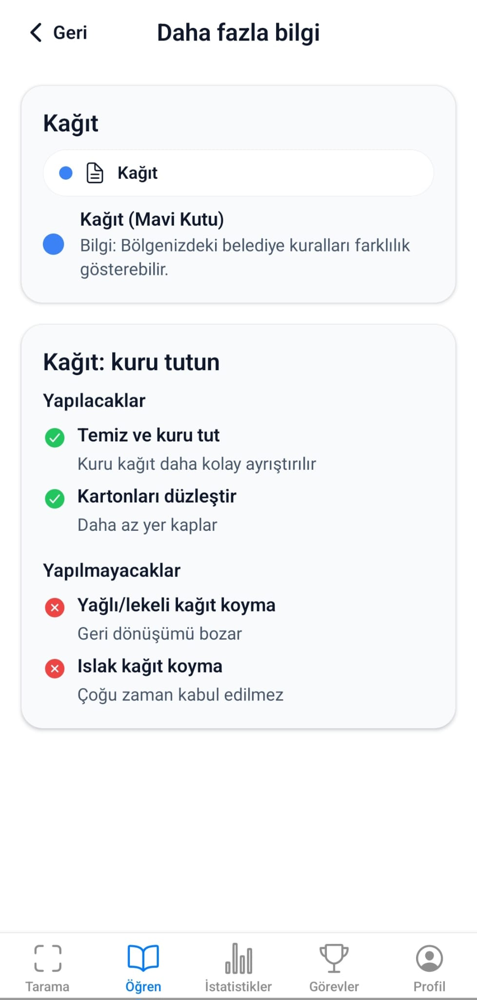
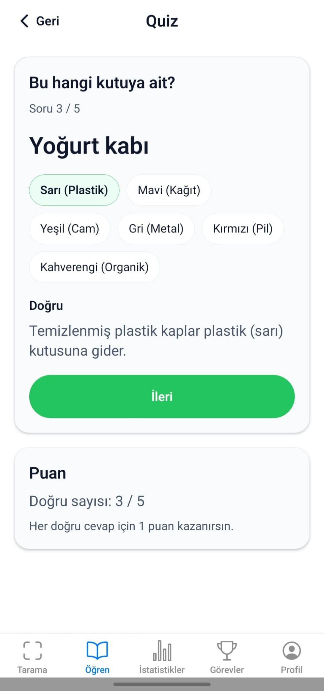

# Smart Recycling Assistant (Mobile App)

React Native + Expo app based on the `Plan/` docs. This MVP is offline-first and uses **mocked** ML detections (label + confidence + optional bounding boxes).

## Application images

### Statistics
Number of items scanned, total score, daily series and weekly task summary; distribution by waste type (plastic, paper, glass, metal, battery, organic).



### Learn – Sorting guides
Categories for proper recycling: Yellow (Plastic), Blue (Paper), Green (Glass), Grey (Metal), Red (Battery), Brown (Organic).



### Learning – Flashcards (Tips / Myths / Impact)
Recycling myths and facts (e.g., glass, broken glass, pizza boxes); impact cards (1 ton of paper = 17 trees, aluminum cans, infinite recycling of glass).




###Learn – More information
Category details: e.g., things to do for paper (keep it clean and dry, flatten cardboard) and things not to do (greasy/wet paper).



### Quiz
Multiple-choice questions and information about recycling objects.



---

## Run

```bash
npm install
npm run start
```

- Use a real device for the camera flow (Expo Go or a dev build).

## Use your YOLOv8 model (`trainedmodel/best.pt`)

Your `trainedmodel/best.pt` is a PyTorch model and can’t run directly inside a managed Expo app. The simplest integration is to run inference in a small API (included) and have the app call it.

### Option 1: API inference (fast to ship)

### 1) Start the inference API

```bash
python -m venv .venv
source .venv/bin/activate
pip install -r server/requirements.txt
uvicorn server.main:app --host 0.0.0.0 --port 8000
```

Health check: `http://<your-ip>:8000/health`

### 2) Point the app at the API

Set these environment variables (Expo reads `EXPO_PUBLIC_*` variables at runtime):

```bash
EXPO_PUBLIC_INFERENCE_MODE=api
EXPO_PUBLIC_INFERENCE_URL=http://<your-ip>:8000
EXPO_PUBLIC_MIN_CONFIDENCE=0.7
```

Notes:
- If you test on a physical phone, use your computer’s LAN IP (not `localhost`).
- Android emulator uses `http://10.0.2.2:8000` (not `localhost`).
- After changing env vars, restart Metro with cache clear: `npx expo start -c`.
- If the API is unreachable or misconfigured, the app will show an error. Fix the URL and restart Expo.

### Switch models (YOLO + Faster R-CNN)

The server can load multiple models, and the Scan screen shows a dropdown to switch between them.

Server env vars (optional but recommended):

```bash
# YOLO
YOLO_MODEL_PATH=/app/trainedmodel/best.pt
YOLO_MODEL_LABEL=YOLOv8 (best.pt)

# Faster R-CNN (torchvision)
FRCNN_MODEL_PATH=/app/trainedmodel/best_model_75.pth
FRCNN_CLASS_NAMES=cam,kagit,metal,pil,plastik
FRCNN_NUM_CLASSES=6
FRCNN_MODEL_LABEL=Faster R-CNN (best_model_75.pth)

# default selection
DEFAULT_MODEL_ID=yolo
```

The server exposes `GET /models`, and the app will use it automatically to populate the dropdown.

### Option 2: On-device inference (offline, requires a dev/prod build)

This runs the model on the phone using ONNX Runtime (`onnxruntime-react-native`). It does **not** work in Expo Go.

1) Export your model to ONNX (Ultralytics):

```bash
pip install ultralytics
yolo export model=trainedmodel/best.pt format=onnx imgsz=640 dynamic=True
```

2) Host the exported `.onnx` file somewhere the app can download (use **HTTPS** for iOS), e.g. GitHub Releases / S3 / Cloudflare R2.

3) Configure the app:

```bash
EXPO_PUBLIC_INFERENCE_MODE=device
EXPO_PUBLIC_ONNX_MODEL_URL=https://<host>/best.onnx
EXPO_PUBLIC_ONNX_MODEL_NAME=waste-best.onnx
EXPO_PUBLIC_MIN_CONFIDENCE=0.7
```

4) Build and install (example: Android production APK via EAS Build):

```bash
npm i -g eas-cli
eas build:configure
eas build -p android --profile production
```

### Live (realtime-ish) scanning

On the Scan screen, tap `LIVE` to run continuous detection while the camera preview is open. Capturing a photo stops live mode and runs a single “final” inference for the Result screen.

This is implemented by taking low-quality snapshots periodically and running inference (API or on-device), so FPS depends on your phone + network + server (if using API). Some devices may play a shutter sound for each snapshot.

If your server supports WebSockets (`/stream`), the app will use streaming for live mode. You can set:

```bash
EXPO_PUBLIC_INFERENCE_WS_URL=wss://<host>/stream
```

## Put the server online (so everyone can use it)

You need to deploy the `server/` as a public HTTPS URL, then set `EXPO_PUBLIC_INFERENCE_URL` to that URL in your app build.

### Option A: Render / Railway / Fly.io (Docker)

This repo includes a `Dockerfile` (it bakes in `trainedmodel/best.pt`).

- Deploy the Docker image on your platform of choice.
- Your service must listen on `$PORT` (the container command already does this).
- Set env vars (optional): `MODEL_PATH`, `MODEL_VERSION`, `ALLOW_ORIGINS`.

### Option B: Google Cloud Run (simple + scalable)

```bash
# from repo root
gcloud builds submit --tag gcr.io/<PROJECT_ID>/waste-inference
gcloud run deploy waste-inference \
  --image gcr.io/<PROJECT_ID>/waste-inference \
  --region <REGION> \
  --allow-unauthenticated
```

Cloud Run will print a HTTPS URL like `https://waste-inference-xxxxx.a.run.app`.

### Point the app at your hosted URL

Set in `.env.local` (dev) or in your EAS build env (production):

```bash
EXPO_PUBLIC_INFERENCE_MODE=api
EXPO_PUBLIC_INFERENCE_URL=https://<your-host>
```

Important: because this URL is shipped in the app, it’s public. For a real public launch, add rate limiting / auth at the edge (or accept that anyone can hit it).

## What’s implemented

- Bottom tabs: Scan, Learn, Stats, Challenges, Profile
- Scan → capture → mocked inference → Result (with optional bounding box overlay)
- Confirm sorting (+10 points), streaks, badges, weekly challenges, local persistence (AsyncStorage)
- Learn cards + waste-type guides + 5-question quiz (+1 point per correct answer)
